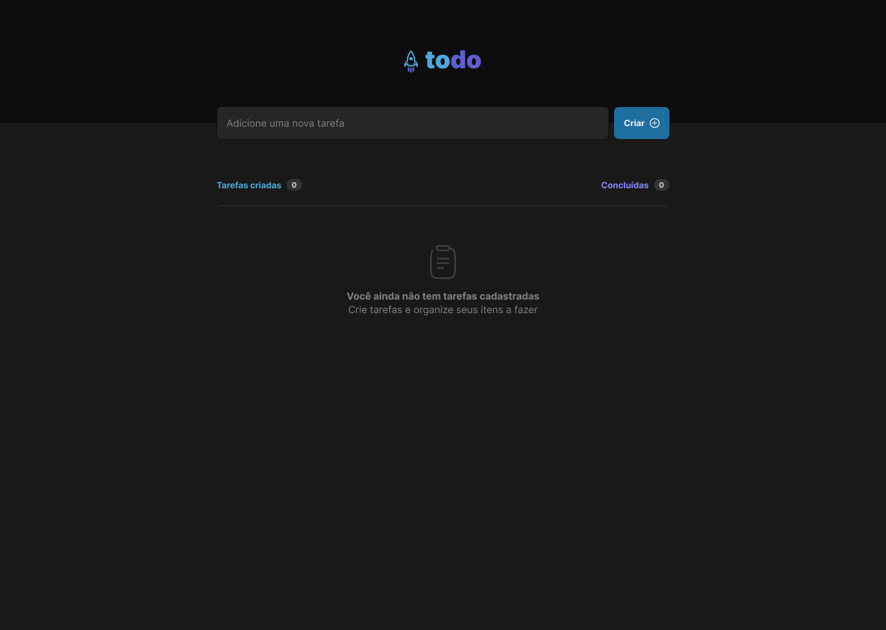
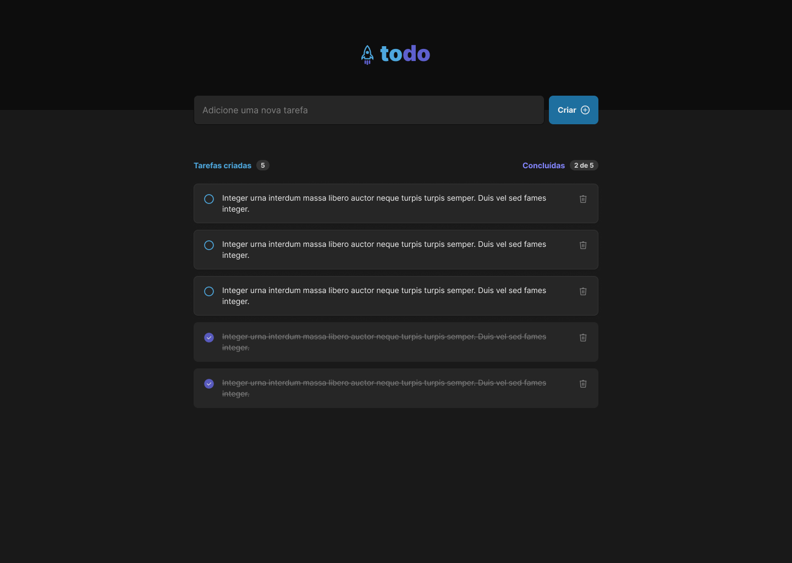

<p align="center">
  
</p>


<p align="justify">

Aplicação de lista de tarefas desenvolvida como parte do **Desafio 01 – Praticando os conceitos do ReactJS**, com foco na consolidação dos fundamentos do React, como **componentização**, **estado**, **imutabilidade** e **manipulação de listas**.
</p>

## 📄 Instruções do Desafio

Confira os detalhes completos do desafio [clicando aqui](https://efficient-sloth-d85.notion.site/Desafio-01-Praticando-os-conceitos-do-ReactJS-91fd63dd1a5b4a2796152de293ec1074).


## 🎨 Layout

O layout da aplicação está disponível no [Figma](https://www.figma.com/design/AUtAJ28ZypXVOwz2Vb54Ge/ToDo-List--Copy-?node-id=43-88&t=SOm4YcV2pn9bTCiY-0)

## 📸 Preview do Projeto

<p align="center">
  
  
</p>

## ✨ Funcionalidades

✔️ Criar uma nova tarefa  
✔️ Marcar tarefa como concluída  
✔️ Remover tarefa  
✔️ Contador de tarefas criadas  
✔️ Contador de tarefas concluídas  
✔️ Estado vazio quando não há tarefas  

## 🛠️ Tecnologias utilizadas

- [React](https://react.dev/)
- [TypeScript](https://www.typescriptlang.org/)
- [Vite](https://vitejs.dev/)

## 🚀 Como executar o projeto

### Pré-requisitos

<p align="justify">Antes de começar, você vai precisar ter instalado em sua máquina as seguintes ferramentas:</p>

<a href="https://skillicons.dev">
  
</a>

### Clone o repositório

```bash
# Clone este repositório
$ git clone <https://github.com/Gelzieny/ignite-react-todo-list.git>

# Acesse a pasta do projeto no terminal/cmd
$ cd ignite-react-todo-list

# Instale as dependências
$ npm install

# Execute a aplicação em modo de desenvolvimento
$ npm run dev

# O servidor inciará na porta:3334 - acesse <http://localhost:5173>
```

# 🧑🏻‍💻 Autor

Feito com ❤️ por Gelzieny R. Martins 👋🏽 [Entre em contato!](https://gelzieny-dev.vercel.app/)

## 📝 Licença

Este projeto esta sobe a licença [MIT](./LICENSE).
